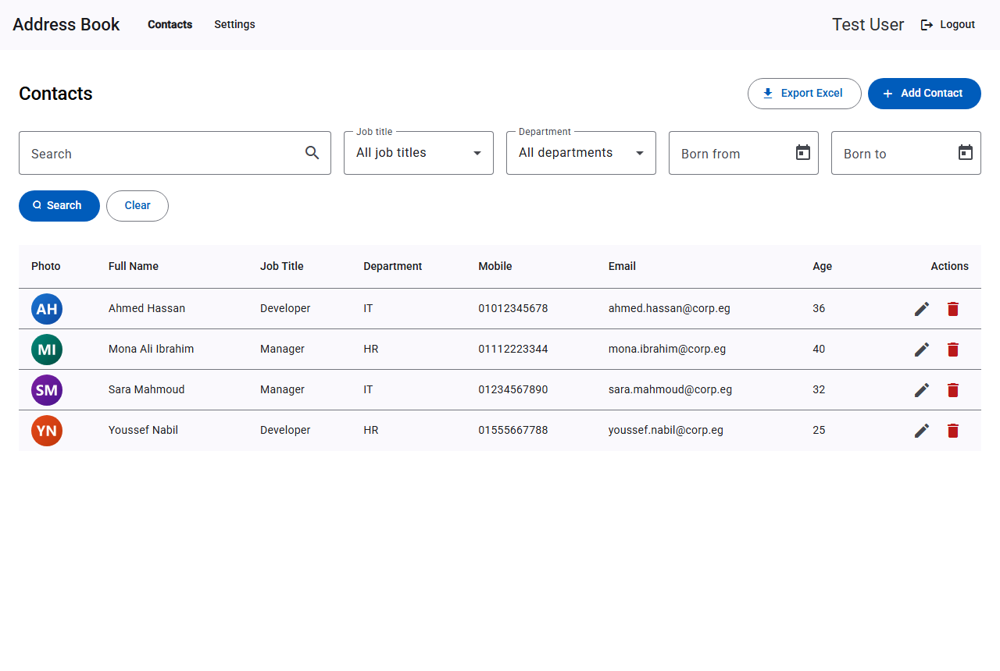
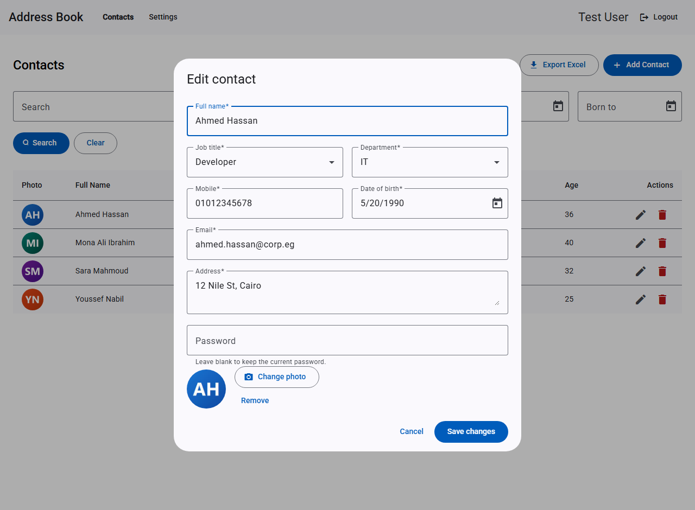
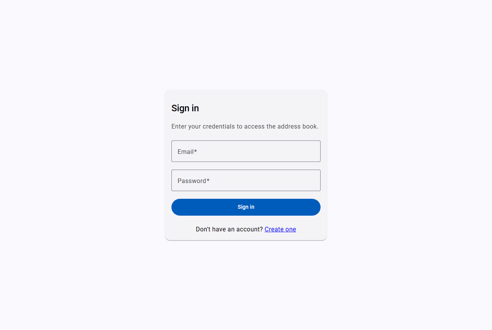
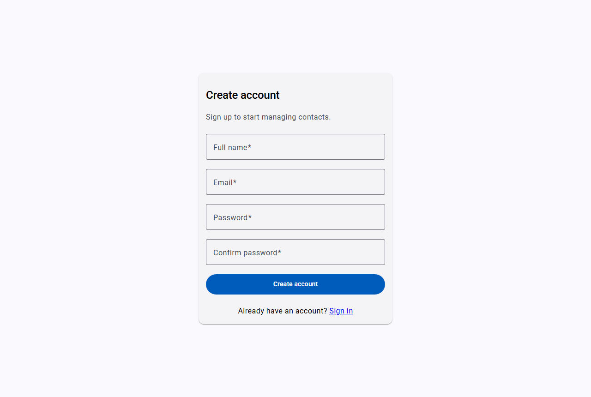
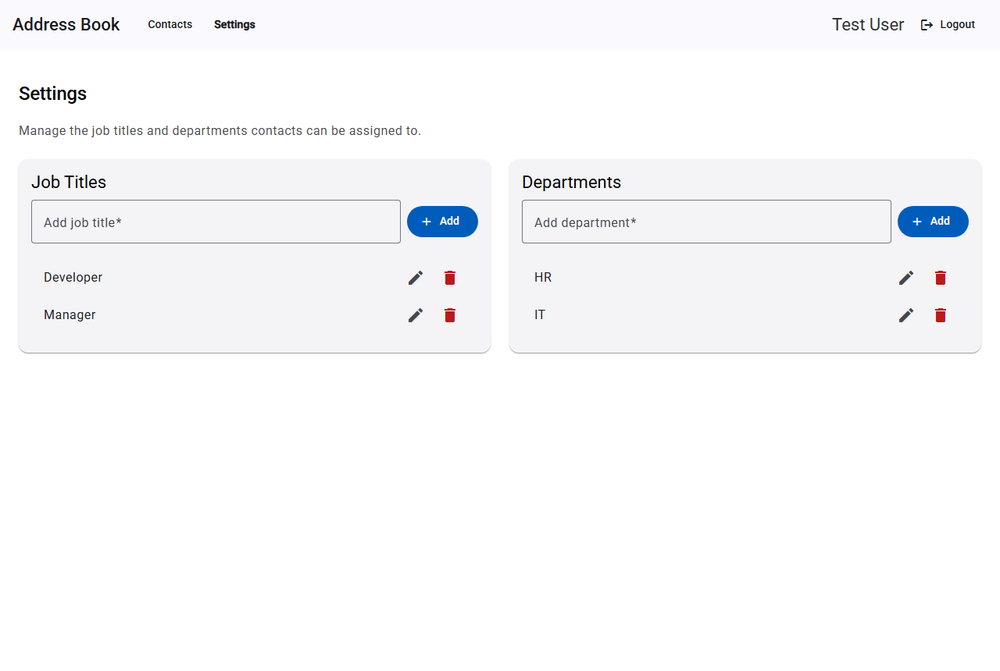
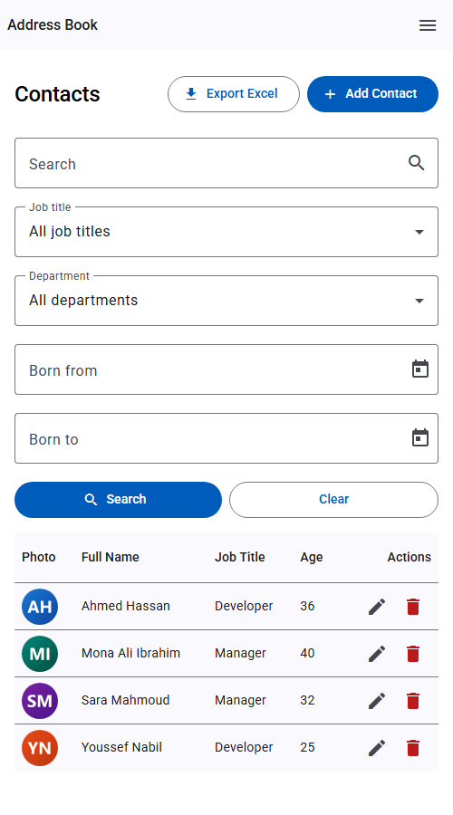
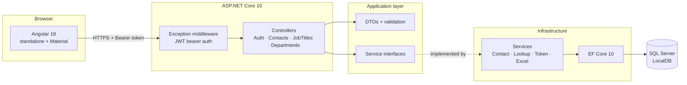
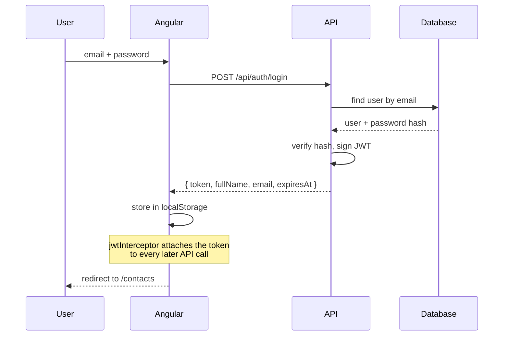
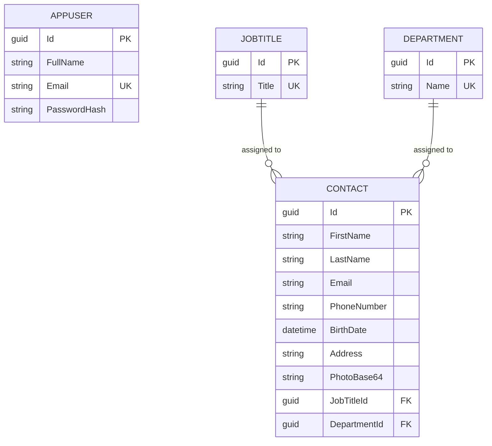

# Address Book

A small contact-management app: an ASP.NET Core API with a JWT-secured REST surface, and an Angular
front end built on Material. You sign in, manage a list of contacts, tag each one with a job title
and a department, filter the list however you like, and export whatever you're looking at to Excel.

It's a straightforward CRUD app, but a few things in it are less obvious than they look — the photo
handling, the "leave the password alone" edit path, and the way lookups refuse to be deleted while
contacts still point at them. Those are covered further down.

---

## Screenshots

### The contact list

Search, filter, export and the whole table in one place. Avatars come out of the database as base64.



### Adding and editing

One dialog does both jobs — it switches its title, its submit button and its password rules based on
whether you handed it a contact or a `null`. On an edit it arrives pre-filled, photo included, and the
password field stays empty because leaving it that way keeps the existing one.



### Signing in

| | |
|---|---|
|  |  |
| Login | Register, with the two passwords cross-validated |

### Job titles and departments



### On a narrow screen

Below 600px the toolbar folds into a menu button and the filter bar stacks; below 768px the table drops
Department, Mobile and Email and keeps what fits.



> Captured with headless Edge at 500px, which is as narrow as a headless Chromium window will go — the
> engine clamps below that. On a real 360px phone the same rules apply; there's just less room.

---

## How it fits together



The solution is layered the conventional way: `API` knows about `Application` and `Infrastructure`,
`Infrastructure` implements the interfaces `Application` declares, and `Domain` sits at the bottom
knowing about nobody. The only slightly unusual choice is that controllers talk to services directly
rather than going through a mediator — for an app this size that indirection would earn nothing.

### Signing in



The token expiry is stored alongside the token, so the route guard can reject an expired session
locally instead of firing a request that's guaranteed to 401.

### The data



Both foreign keys use `DeleteBehavior.Restrict`, which is what makes the 409-on-delete behaviour
possible instead of silently cascading contacts away.

---

## Running it

You'll need the **.NET 10 SDK**, **Node 18/20/22**, and **SQL Server LocalDB** (it ships with Visual
Studio; `sqllocaldb info` will tell you if it's there).

**1. Trust the dev certificate** — the front end talks to the API over HTTPS, and the browser will
quietly refuse the calls otherwise:

```bash
dotnet dev-certs https --trust
```

**2. Start the API.** It creates and migrates the database on first run, then seeds a user, two job
titles and two departments:

```bash
dotnet run --project backend/AddressBook/AddressBook.API --launch-profile https
```

That gives you `https://localhost:7029` (and `http://localhost:5051`). Swagger is at
`https://localhost:7029/swagger` in Development, with an **Authorize** button — paste in a token from
`/api/auth/login` and the rest of the endpoints unlock.

**3. Start the front end:**

```bash
cd frontend && npm install && npm start
```

Then open `http://localhost:4200`.

**4. Sign in** with the seeded account, or register your own:

```
abdo@gmail.com  /  admin123
```

### If port 4200 is busy

`ng serve --port 4300` works out of the box — the API's CORS policy already allows both `4200` and
`4300`. Any other port needs adding to `WithOrigins(...)` in `Program.cs`, or the browser will block
every request with what looks like a network error.

---

## What's in the repo

```
backend/AddressBook/
  AddressBook.Domain/          entities, ConflictException
  AddressBook.Application/     DTOs, validation, service interfaces
  AddressBook.Infrastructure/  EF Core, services, migrations
  AddressBook.API/             controllers, middleware, Program.cs

frontend/src/app/
  core/       models, services, jwt + error interceptors, auth guard
  shared/     confirm dialog, prompt dialog, small utils
  layouts/    auth shell (centred card) and main shell (toolbar)
  features/   auth, contacts, lookups
```

## The API

Everything except register and login needs `Authorization: Bearer <token>`.

| Method | Route | What it does |
|---|---|---|
| `POST` | `/api/auth/register` | Create an account |
| `POST` | `/api/auth/login` | Get a token |
| `GET` | `/api/auth/me` | Echo the current token's claims |
| `GET` | `/api/contacts` | List, filtered by query string |
| `GET` | `/api/contacts/export` | Same filter, returns `AddressBook.xlsx` |
| `GET` | `/api/contacts/{id}` | One contact |
| `POST` `PUT` `DELETE` | `/api/contacts` | Create, update, hard delete |
| `GET` `POST` `PUT` `DELETE` | `/api/jobtitles` | Job title CRUD |
| `GET` `POST` `PUT` `DELETE` | `/api/departments` | Department CRUD |

The contact filter accepts `searchTerm`, `jobTitleId`, `departmentId`, `birthDateFrom` and
`birthDateTo`, all optional. `searchTerm` matches across name, email, mobile, address, job title and
department in one pass. The date bounds are inclusive on both ends.

---

## Things worth knowing before you change something

**Passwords on edit.** `ContactSaveDto.Password` is optional. Send one and it gets rehashed; leave it
out and the existing hash is untouched. That's what lets the edit dialog say "leave blank to keep the
current password" without the API rejecting the request.

**Photos.** They're stored as raw base64 in an `nvarchar(max)` column — no `data:` prefix, the client
adds and strips that. The column started at 1000 characters, which sounds fine until you notice that's
about 750 bytes, smaller than any real photograph. The `WidenContactPhoto` migration fixed it. The
form caps uploads at 1 MB.

**Deleting a lookup that's in use returns 409**, not 500 — the service counts referencing contacts
first and raises a `ConflictException` with a message naming the count. The UI shows it in a snackbar
and leaves the row alone.

**Two error shapes.** Thrown exceptions come back as `{ "message": "..." }` from the global
middleware. Model-validation failures short-circuit before any exception and come back as ASP.NET's
standard `ValidationProblemDetails` with an `errors` dictionary. The Angular error interceptor reads
both. If you want a single envelope, that's an `InvalidModelStateResponseFactory` away.

**Dates are sent as plain `yyyy-MM-dd` strings.** Not `toISOString()` — that converts to UTC first,
and a date picked at local midnight in a negative-offset timezone comes out as the day before. There's
a `toIsoDate` helper in `shared/utils` doing this properly.

**Node 24 isn't supported by Angular 18.** It builds and runs today, but the CLI prints
`Node: (Unsupported)` on every command. If you hit a strange build failure, check your Node version
before you check your code.

**If `ng serve` seems to ignore your changes,** look at its output rather than the browser. Creating a
component's `.ts` before its `.html` leaves the watcher stuck on a failed build, and it'll keep serving
the last good bundle. Touching the file recovers it. Similarly, installing a new package mid-session can
leave Vite's pre-bundled deps mismatched, which shows up as a confusing `NG0203` at runtime — restart
the dev server rather than debugging your injector.

---

## Known gaps

- Adding or editing a contact splices the result into the local table without re-checking the active
  filter, so a new row can appear even when it wouldn't match a refetch.
- The empty state reads "No contacts found" whether the database is empty or the filter simply
  excluded everything.
- A failed Excel export shows a generic message, because the error body arrives as a `Blob` and the
  interceptor can't read it synchronously.
- `Contact` carries its own `PasswordHash`, which nothing currently authenticates against.
- No tests yet. Everything here was verified by hand against a running stack.
